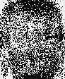
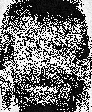
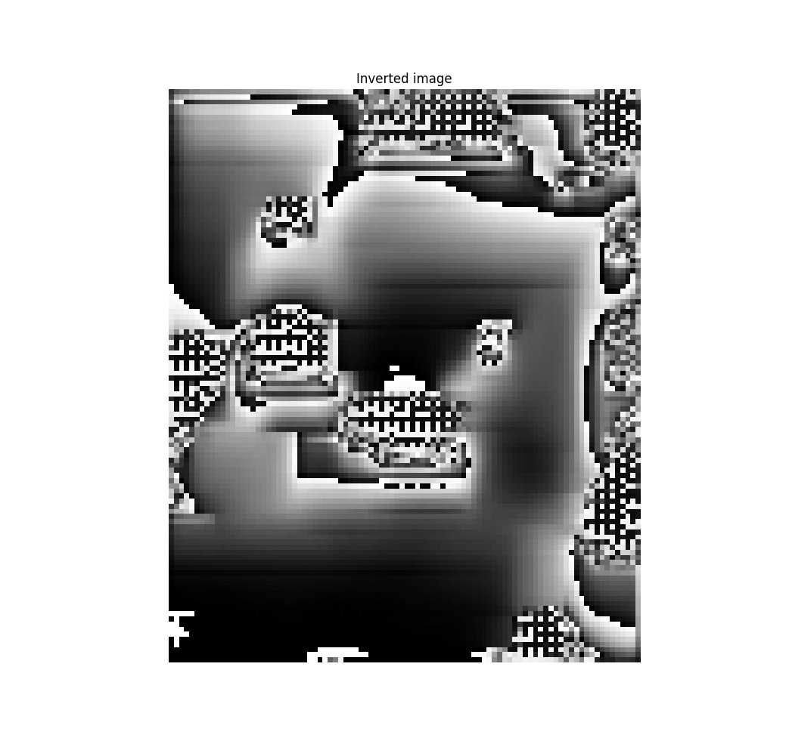

# Model Inversion Attack with Face Classification Model
This is an implementation of the model inversion attack described in "Model Inversion Attacks that Exploit Confidence Information and Basic Countermeasures" (Fredrikson Et al.)

## Setup
Create and activate python virtual environment
```
python3 -m venv env
source env/bin/activate
```
Install all needed python modules in the virtual environment
```
pip3 install -r requirements.txt
```

## Usage
First you need to traing your own model for face classification. The dataset provided in this repository is the ATT Face Dataset. This dataset contains 40 Persons (40 classes) and 10 images for every person.
The folder structure in the dataset folders is the following:
```
├── s1
    ├── s1
    ├── s2
    ├── s3
    ...   
    ├── s39
    └── s40
```
There are two folders containing the dataset. The `face-images` folder contains all face images except the first image of every class (s1.png). So there are 9 images for every class. The 10th image of every class is located in the `test-images` folder used to test the model.

If you properly tweaked the model and its parameters to your needs, you can train the model with the data in the `face-images-all` folder, which contains ALL face images (so 10 images per class).

The model's summary looks like this:
```
Found 400 files belonging to 40 classes.
Using 80 files for validation.
Model: "sequential"
_________________________________________________________________
 Layer (type)                Output Shape              Param #
=================================================================
 flatten (Flatten)           (None, 10304)             0

 dense (Dense)               (None, 40)                412200

=================================================================
Total params: 412,200
Trainable params: 412,200
Non-trainable params: 0
```

After training the model, you can call the `adversary.py` script. This script uses a zeros-input vector and the previously trained model to optimizes the input vector towards one of the model's classes. The class you want invert can be set in the matrix `class_labels`.
The default optimizer used is a SGD optimizer with a learning rate of 0.01.

The generated inversed image is saved as `img_adversary_img.png`. This image is saved every 500 epochs and rewrites the previous image.

## Results
These are some results of different runs with different learning rates, batch sizes, etc.





The model is a simple one-layer neural network. For this attack it seems that the architecture of the network has a huge influence on the inversion. I found that this attack is not feasible with CNNs and the current approach on inversion.
Here example of how a CNN-inversed image looks like:



## Problems
Currently, the vector used to run this attack tends to take on negative values. This is the reason why all generated images are pure black/white. We could retrieve more details in the images, if the output of this implementation would be a vector, which could be used to create a grayscale image. However, I could not yet find a way to achieve this.

Also more testing for better parameters or changes in the loss function could be helpful to increase the outcome of this attack.
